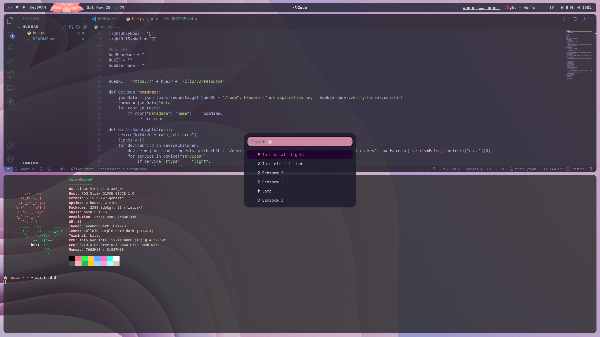
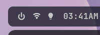

# hue-bar
This is a Rofi-based Philips Hue light controller
Intended for use with Polybar but can be used with anything that can integerate Rofi





### Dependencies
- Rofi
- Python 3.3+
  - rofi_menu
You can simply install the python dependencies by typing:
`pip install rofi_menu`

### Setting up hue.py
To get the proper API keys you must go to the following link and make an account:
https://developers.meethue.com/develop/hue-api-v2/getting-started/
Once you've made an account follow along the steps to get your Hue bridge IP & username
Paste these values into the matching variables at the top of the hue.py file
Your room name will be the same name as what you set it on your other devices, its also case sensitive

### Polybar Config
Paste this in your config.ini file
```
[module/lights]
type = custom/text
content = "󰌵"
click-left = rofi -modi mymenu:/home/murad/.config/Scripts/hue.py -show mymenu -show-icons
```
